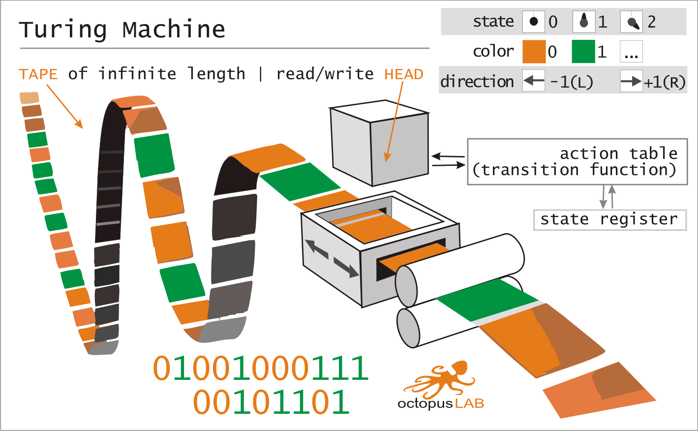

# ESP32 micropython_turing-emul
ESP32 &amp; MicroPython - turing machine emulator



A Turing machine is a mathematical model of computation that defines an abstract machine, which manipulates symbols on a strip of tape according to a table of rules.

---

This repo contains ESP32 Micropython application based on **OctopusLAB Framework** -> [octopusengine/octopuslab](https://github.com/octopusengine/octopuslab).

This runs example, that allows you to control I/O peripherals connected to your [OctopusLAB EDU_KIT1](https://www.octopusengine.org/edu-kit1/).

## Emulator

### Python

```
programs_turing/...
turing.py
run.py
```

### MicroPython

```
programs_turing/...
lib/pubsub.py
components/rgb.py
uturing.py
main.py
```

### program_file

The program is loaded as a text file (`programs_turing/program.txt`) where **each line represents a transition function of the form fn(p,X)=(Y,D,q)**, 
so the 5-tuple are strictly in the order p, X, Y, D, q *(the character _ represents a blank symbol on the tape)*

```
fn(p,X)=(Y,D,q)

p: State (0..n)
X: Symbol Read (0/1/_) "IF READ X THEN WRITE Y"
Y: Write Instruction (0/1/_)
D: Move Instruction (L/R/*) / Direction
q: Next State (n/H)

State | Symbol Read || Write Instruction |	Move Instruction	| Next State
p X | Y D q

-> program.txt one line: p X Y D q

```

Simple example - inverse (program_turing/program_inv.txt)

```
0 0 1 R 0
0 1 0 R 0
0 _ _ * H

```

---

### usage | run_src()

```python
# --- inversion (binary negation) ---
program = 'programs_turing/program_inv.txt'
input = '11100101' # return: 00011010 H
run_src(program, input)
```

```
=======================================
File: programs_turing/program_inv.txt
=======================================
0 0 1 R 0
0 1 0 R 0
0 _ _ * H

=======================================
Input:  11100101
---------------------------------------
   [  i]   H (s) tape
.......................................
   [  0]  51 (0) 01100101
   [  1]  52 (0) 00100101
   [  2]  53 (0) 00000101
   [  3]  54 (0) 00010101
   [  4]  55 (0) 00011101
   [  5]  56 (0) 00011001
   [  6]  57 (0) 00011011
   [  7]  58 (0) 00011010
   [  8]  58 (H) 00011010
Output:  00011010

```

```
--- Table: --- 
[  i]  - iteration
H      - head position
(s)    - state
tape   - actual "value"

```

---

Links:

https://en.wikipedia.org/wiki/Turing_machine

https://www.cl.cam.ac.uk/projects/raspberrypi/tutorials/turing-machine/four.html

https://sandipanweb.wordpress.com/2020/08/08/simulating-a-turing-machine-with-python-and-executing-programs


